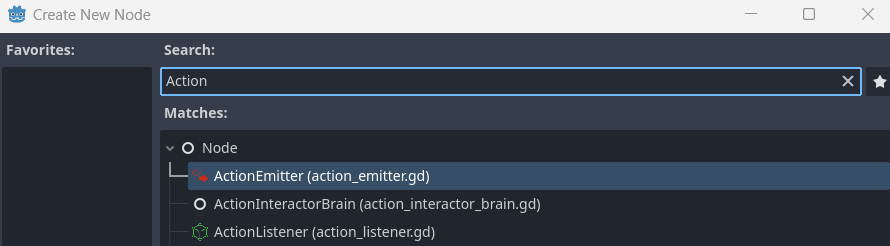
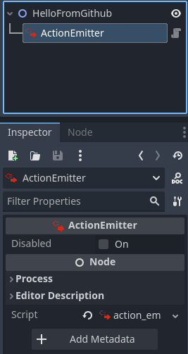
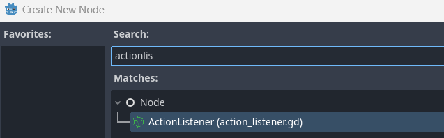
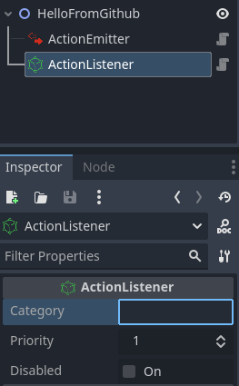

<p align="center">
	
	<h1 align="center">Connected</h1>
	
[](https://github.com/bananaholograma/connected/commits)
[](https://github.com/bananaholograma/connected/stargazers)
[](https://github.com/bananaholograma/connected/releases)
[](https://github.com/bananaholograma/connected/blob/main/LICENSE.md)
[](https://github.com/bananaholograma/connected/pulls)
[](https://ko-fi.com/bananaholograma)
</p>

[](https://github.com/bananaholograma/connected/blob/main/locale/README.es-ES.md)

- - -
A minimalist node-oriented event system that fits perfectly with the Godot philosophy.

- [Requirements](#requirements)
- [✨Installation](#installation)
	- [Automatic (Recommended)](#automatic-recommended)
	- [Manual](#manual)
- [How to use](#how-to-use)
	- [ActionInteractor](#actioninteractor)
	- [ActionEmitter](#actionemitter)
		- [Add via editor](#add-via-editor)
		- [Add via script](#add-via-script)
		- [Available methods](#available-methods)
			- [send(action: Action)](#sendaction-action)
			- [enable() \& disable()](#enable--disable)
		- [Signals](#signals)
	- [The Action class](#the-action-class)
		- [Properties](#properties)
		- [Hooks](#hooks)
	- [ActionListener](#actionlistener)
		- [Available properties](#available-properties)
		- [Available methods](#available-methods-1)
			- [enable() \& disable()](#enable--disable-1)
		- [Listen to actions](#listen-to-actions)
- [✌️You are welcome to](#️you-are-welcome-to)
- [🤝Contribution guidelines](#contribution-guidelines)
- [📇Contact us](#contact-us)


# Requirements
📢 We don't currently give support to Godot 3+ as we focus on future stable versions from version 4 onwards
* Godot 4+

# ✨Installation
## Automatic (Recommended)
You can download this plugin from the official [Godot asset library](https://godotengine.org/asset-library/asset/2572) using the AssetLib tab in your godot editor. Once installed, you're ready to get started
##  Manual 
To manually install the plugin, create an **"addons"** folder at the root of your Godot project and then download the contents from the **"addons"** folder of this repository


# How to use
When you've been working with Godot for a while you discover that it has a fun node system to use. This plugin wants to help you implement a very easy minimalistic event system using nodes.

## ActionInteractor
This is the core of the plugin and we recommend not to alter its content since **it is only responsible for receiving and propagating actions**. You can use it in read mode as it contains the active emitters & listeners in your game in case you want to get their information.

Whenever you **disable or enable an ActionEmitter & ActionListener** this singleton emit the corresponding signal to report their connection or disconnection in case you want to react to these changes.


***The propagation is based on the `priority` property from `ActionListeners` who will react to this action so listeners with a higher priority will receive the action before the others.***

```python
## Retrieve all the active emitters
ActionInteractor.emitters
## Retrieve all the active listeners
ActionInteractor.listeners

## Available signals to connect
signal action_emitter_connected(action_emitter: ActionEmitter)
signal action_emitter_disconnected(action_emitter: ActionEmitter)
signal action_listener_connected(action_listener: ActionListener)
signal action_listener_disconnected(action_listener: ActionListener)

## A normal connection to a Godot signal
ActionInteractor.action_emitter_disconnected.connect(##...)
```


## ActionEmitter
Its sole purpose is to send actions to the singleton `ActionInteractor`. This actions are defined by the provided `Action` class which allows you to create your own custom behaviours.

### Add via editor
It's easy as find the node and add to the scene tree:





### Add via script
```python
## Inside the node script you want to add the ActionEmitter, we use _ready as an example but could be in any other place
func _ready():
	var action_emitter = ActionEmitter.new()
	add_child(action_emitter)
```

### Available methods
#### send(action: Action)
Send an action to the `ActionInteractor`, the latter will propagate it to the active listeners in the scene tree. If the action is `disabled` this function will not send anything

```python
@onready var action_emitter: ActionEmitter = $ActionEmitter

func pressed():
	var action = Action.new()
	action_emitter.send(action)
```

#### enable() & disable()
Enable or disable this action emitter so that it cannot send actions to the `ActionInteractor`. 

### Signals
```python
signal emitted_action(action: Action)
signal canceled_action(action: Action)
```

## The Action class
This is the minimalist base class that this plugin uses to send and receive via the `ActionInteractor`. It was designed to inherit it and add new properties or resources as well as overwrite its functions as a "hook" to provide your own behaviors.

### Properties
```python
var id: String # If no value is provided, it generates a random unique ID
var priority := 1
var is_listened := true
var listened_by := []
var ignored_by := []

func _init(_id: String = _generate_random_id(), _is_listened: bool = true, _priority: int = 1):
	id = _id
	is_listened = _is_listened
	priority = _priority
```

`listened_by` and `ignored_by` can be used to add the category to which a listener belongs. If they are empty by default the action will be propagated to the available listeners in the scene tree. The `category` property on listener is case-sensitive and they need to be set on the editor property of this node. More information on [ActionListener][#actionlistener]

You can use the methods:

 - `add_listened_by_categories(categories: Array[String], overwrite: bool = false) -> void:`

 - `add_ignored_by_categories(categories: Array[String], overwrite: bool = false) -> void:`

For example:
```python
var action = Action.new()
action.add_listened_by_categories(["enemies", "towers"])
action.add_ignored_by_categories(["weapons", "player"])
```

### Hooks
If `before_emit()` returns a falsy value the `Action` will trigger the `canceled_action` signal and `after_cancel` hook will be called as a consequence. Feel free to override this functions but **make sure that the `before_emit()` return always a boolean value.**
```python
func before_emit() -> bool:
	return true


func after_emit()-> void:
	pass


func after_cancel() -> void:
	pass
```

In the next custom action example we create an imaginary skill action where we check if the target provided is water before emit
```python

class_name FireballAction extends Action

var current_target

## If the target selected is water type we cancel the action
func before_emit() -> bool
	return not target.type is Water:


func select_target(target):
	current_target = target


### Send the action with any emitter available
var fireball = FireballAction.new()
fireball.select_target(enemy)
fireball.damage = 150

action_emitter.send(fireball)
```

## ActionListener
This is the next most important node, wherever it is added in the scene tree it will listen to the actions of any `ActionEmitter` as long as the action is listened by the category selected or has no restrictions.

The `ActionListener` does not need to be added in the same hierarchy as an action emitter. The `ActionInteractor` singleton is responsible for propagating the actions to the appropriate listeners.





### Available properties
```python
@export var category: String
@export_range(1, 1000, 1) var priority := 1
@export var disabled := false:
```
### Available methods

#### enable() & disable()
Enable or disable this listener.

### Listen to actions
The way to listen for actions is connecting to the provided signal `listened_action(action: Action)` from this node. Every time an `Action` is successfully sent and the listener is valid to listen to it, you will be able to get it from this signal

```python
@onready var spell_listener: ActionListener = $ActionListener

func _ready():
	spell_listener.category = "spells" # So this listener only receive Actions where the property listened_by has this category
	spell_listener.listened_action(on_listened_action)


func on_listened_action(action: Action):
	## Do your stuff...

## If you know exactly that this listener will receive always a specific CustomAction you can type the parameter more precisely
func on_listened_action(action: SpellAction):
	## Do your stuff...
```


# ✌️You are welcome to
- [Give feedback](https://github.com/bananaholograma/connected/pulls)
- [Suggest improvements](https://github.com/bananaholograma/connected/issues/new?assignees=BananaHolograma&labels=enhancement&template=feature_request.md&title=)
- [Bug report](https://github.com/bananaholograma/connected/issues/new?assignees=BananaHolograma&labels=bug%2C+task&template=bug_report.md&title=)

This plugin is available for free.

If you're grateful for what we're doing, please consider a donation. Developing plugins requires massive amount of time and knowledge, especially when it comes to Godot. Even $1 is highly appreciated and shows that you care. Thank you!

- - -
# 🤝Contribution guidelines
**Thank you for your interest in this plugin!**

To ensure a smooth and collaborative contribution process, please review our [contribution guidelines](https://github.com/bananaholograma/connected/blob/main/CONTRIBUTING.md) before getting started. These guidelines outline the standards and expectations we uphold in this project.

**📓Code of Conduct:** We strictly adhere to the [Godot code of conduct](https://godotengine.org/code-of-conduct/) in this project. As a contributor, it is important to respect and follow this code to maintain a positive and inclusive community.

- - -

# 📇Contact us
If you have built a project, demo, script or example with this plugin let us know and we can publish it here in the repository to help us to improve and to know that what we do is useful.
